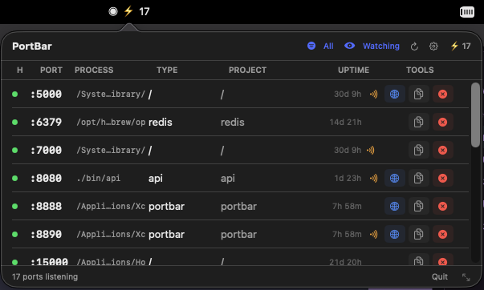

<p align="center"></p>

# PortBar

A native macOS menu bar app that shows every active listening port on your machine — with process name, framework detection, project folder, uptime, and health status.

```
⚡ 5
```

Click the icon → a panel drops down listing all your ports. Kill a runaway process, open it in the browser, or copy the port — all without touching the terminal.

<p align="center">
  
</p>

---

## Features

- **Live port list** — shows every TCP port in LISTEN state with process name, type, project folder, and uptime
- **Process column** — shows the exact binary name running on each port (e.g. `node`, `python3`, `ARDAgent`)
- **Framework detection** — recognizes Next.js, Vite, Express, Django, FastAPI, Flask, Rails, PostgreSQL, Redis, MongoDB, nginx, and more
- **Health status** — color-coded dot per port: 🟢 healthy · 🟡 orphaned · 🔴 zombie
- **LAN-exposure marker** — an orange 📡 antenna flags ports bound to all interfaces (`0.0.0.0`/`*`), meaning other devices on your network can reach them; ports bound to `127.0.0.1` (local-only) have no marker
- **Filtered & All modes** — default view hides system/tool processes (matches `ports`); toggle **All** to show everything (matches `ports --all`)
- **Watch mode** — polls every 3 seconds, menu bar title updates automatically
- **Kill process** — confirms with a dialog, sends SIGTERM → SIGKILL after 3 seconds
- **Open in browser** — one click for HTTP ports (80, 443, 3xxx, 4xxx, 5xxx, 8xxx) and any detected web framework (Vite, Next.js, Django, …)
- **Copy port** — copies `:3000` style to clipboard
- **Settings panel** — auto-watch on launch, default to All mode, and update checker
- **Update checker** — notifies you in-app when a new version is available on GitHub

---

## Install

### Quick install (curl)

```bash
curl -fsSL https://raw.githubusercontent.com/mulhamna/portbar/main/scripts/install.sh | bash
```

Downloads the latest release DMG, installs to `/Applications`, clears quarantine, and launches it.

### Homebrew

```bash
brew tap mulhamna/tap
brew install --cask portbar
xattr -dr com.apple.quarantine /Applications/PortBar.app
open /Applications/PortBar.app
```

### Update

```bash
brew update && brew upgrade --cask portbar
```

> `brew update` is required first — it refreshes the tap so Homebrew knows a new version is available.

### Direct download

1. Download `PortBar.dmg` from [Releases](../../releases)
2. Open the DMG and drag **PortBar.app** to Applications
3. Launch it — the `⚡` icon appears in your menu bar

---

## Usage

| Action            | How                                                              |
| ----------------- | ---------------------------------------------------------------- |
| See all ports     | Click `⚡ N` in the menu bar                                      |
| Toggle All ports  | Click the **filter** button (shows system & tool processes too)  |
| Enable watch mode | Click the **eye** button in the panel toolbar                    |
| Manual refresh    | Click the **↺** button                                           |
| Open settings     | Click the **⚙️** button — auto-watch, default mode, update status |
| Kill a process    | Click the red **✕** button on a port row                         |
| Open in browser   | Click the **🌐** button (HTTP ports & web frameworks)             |
| Spot LAN-exposed  | Orange **📡** on a row = reachable by other devices on your network |
| Copy port         | Click the **📋** button                                           |
| Resize the panel  | Drag the **⤡** grip in the footer (bottom-right); size is remembered |
| Quit              | Footer → Quit                                                    |

### Icon reference

**Toolbar (top of the panel)**

| Icon | Meaning |
| ---- | ------- |
| filter | Toggle **All** — include system & tool processes |
| 👁 eye | Toggle **Watch** — auto-refresh every 3s |
| ↻ | Manual refresh |
| ⚙️ gear | Settings (orange dot = update available) |
| ⚡ N | Number of listening ports |

**Per-port row**

| Icon | Meaning |
| ---- | ------- |
| 🟢 / 🟡 / 🔴 dot | Health — healthy / orphaned / zombie |
| 🟠 `(·))` waves | **LAN-exposed** — bound to all interfaces, other devices can reach it. Absent = local-only (`127.0.0.1`) |
| 🌐 globe | Open in browser (HTTP ports & web frameworks) |
| 📄 copy | Copy `:PORT` to clipboard |
| ⊗ red | Kill the process |

> Hover a truncated **PROCESS** or **PROJECT** cell to see its full path.

---

## What's new in v3.0

- **LAN-exposure marker** — an orange 📡 antenna now flags any port bound to all interfaces (`0.0.0.0`/`*`/`::`), so you can tell at a glance which ports other devices on your network can reach vs. local-only (`127.0.0.1`) ports
- **Reliable kill** — killing a process now refreshes the list immediately (row disappears at once instead of lingering until the next poll), and kills the whole process group so dev-server child workers can't keep the port alive or respawn
- **Wider browser button** — the 🌐 button now covers the `5xxx` range (Vite's `5173`, Flask, CRA) and any detected web framework, not just `3xxx`/`4xxx`/`8xxx`
- **Sturdier scanner** — ports whose `ps` lookup races are still shown (built from `lsof` data) instead of vanishing; Docker container names resolve even when `lsof` truncates the process name; port `443` opens over `https`

---

## What's new in v2.0

- **Parallel scanning** — `ps` and `lsof cwd` now run concurrently instead of sequentially, cutting scan time by ~30–50%
- **Early process filtering** — system processes are filtered out before the expensive shell calls, reducing unnecessary work on machines with many background processes
- **Refresh on popover open** — opening the panel now always triggers a fresh scan, so data is never stale even without Watch enabled
- **Auto Watch on by default** — new installs start with Watch enabled so ports update automatically without any manual setup

|                    | v1.x              | v2.0               |
| ------------------ | ----------------- | ------------------ |
| Scan time          | ~0.25–0.35s       | ~0.15–0.20s        |
| ps + lsof cwd      | Sequential        | Parallel           |
| Process filtering  | After shell calls | Before shell calls |
| CPU avg (Watch on) | ~1.5–2%           | ~0.8–1.2%          |
| RAM peak (scan)    | ~28–32 MB         | ~26–29 MB          |
| Refresh on open    | No                | Yes                |
| Auto Watch default | Off               | On                 |

---

## How it works

PortBar makes exactly **3 shell calls** per scan — same strategy as [port-whisperer](https://github.com/LarsenCundric/port-whisperer):

```bash
# 1. Find every TCP port in LISTEN state
lsof -iTCP -sTCP:LISTEN -n -P

# 2 + 3. Run concurrently — independent of each other
ps -o pid=,comm=,ppid=,stat=,etime= -p <pids>   # process details
lsof -d cwd -a -p <pids> -Fn                     # working directories
```

If Docker is running, a fourth call fetches container names and images:

```bash
docker ps --format '{{.Names}}\t{{.Image}}\t{{.Ports}}'
```

A typical scan takes ~0.15–0.20 seconds (down from ~0.25–0.35s in v1.x).

### Framework detection

For each port, PortBar checks (in order):

1. **`package.json`** — reads `dependencies` + `devDependencies` to identify JS frameworks
2. **Process command line** — detects Django, FastAPI, Flask, Rails, Vite, Next.js by argv
3. **Process name** — falls back to `node`, `python`, `ruby`, `docker`

`package.json` reads are cached per directory to avoid redundant I/O.

### Health status

| Color    | Meaning                                      |
| -------- | -------------------------------------------- |
| 🟢 Green  | Process running normally                     |
| 🟡 Yellow | Orphaned — parent process is gone (ppid = 1) |
| 🔴 Red    | Zombie — process is in Z state               |

---

## Privacy & Security

- **Minimal network calls.** PortBar only contacts GitHub's public releases API to check for updates — no telemetry, no analytics, no tracking.
- **No disk scanning.** It only reads `package.json` in the working directory of each process it finds.
- **No elevated privileges.** PortBar runs as your user. It can only kill processes you own.
- **App Sandbox is off** — required because `lsof` and `ps` cannot run inside the macOS sandbox. This is standard for developer tools (same as many terminal apps and developer utilities). You can inspect the source and build it yourself.

---

## Building from source

Requirements: **Xcode 15+**, macOS 14+

```bash
git clone https://github.com/mulhamna/portbar
cd portbar
open PortBar.xcodeproj
```

Press **⌘R** to build and run, or use the CLI:

```bash
xcodebuild -project PortBar.xcodeproj \
           -scheme PortBar \
           -configuration Debug \
           build
open build/Debug/PortBar.app
```

No dependencies to install — zero third-party packages.

---

## Contributing

Pull requests welcome. A few ground rules:

- Keep it zero-dependency
- macOS 14+ only
- The app sandbox stays off (required for `lsof`)
- Read `CLAUDE.md` before making significant changes — it documents the architecture decisions

---

## License

MIT — see [LICENSE](LICENSE)
